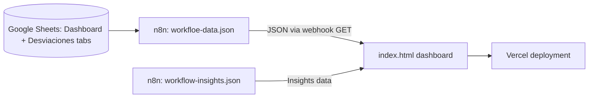

# CLAUDE.md - Enlight One Dashboard

## Purpose
Interactive project dashboard for monitoring photovoltaic and BESS projects across all phases and PMs. Consumes data from Google Sheets via an n8n webhook and deploys to Vercel. Related to the Enlight One PM milestone tracker system.

## Status
- **Phase:** Active
- **Last audited:** 2026-07-01
- **Last modified:** 2026-06-19
- **Owner:** Emiliano / Enlight TECH

## Architecture

## Files & Responsibilities
| File | Type | Purpose |
|------|------|---------|
| index.html | HTML | Main dashboard - dark theme, Chart.js visualizations, multi-tab |
| Dashboard Enlight.dc.html | HTML | Alternate/development version of dashboard |
| workfloe-data.json | n8n | Data fetch workflow (note: typo in filename - missing 'r') |
| workflow-insights.json | n8n | Insights/analytics data workflow |
| vercel.json | Config | Vercel deployment configuration |
| README.md | Docs | Architecture + setup instructions |

## External Dependencies
| System | How connected | Credential location |
|--------|---------------|---------------------|
| Google Sheets | n8n Google Sheets node | n8n credentials store |
| Vercel | Static deployment | Vercel account |

## Design System Compliance
- Fonts: Alexandria (display) + Roboto (body) - Roboto is NOT an Enlight DS font. Should be Albert Sans instead.
- Colors: Custom CSS vars matching brand palette (hardcoded hex, not imported token file).
- Dark theme implemented correctly using near-black backgrounds.
- Auto-refresh every 15 minutes implemented.

## Key Technical Decisions
1. SPI (Schedule Performance Index) metric: hitos cumplidos a tiempo / hitos vencidos - color coded green/yellow/red.
2. 13 hitos tracked per project - aligns with Enlight One milestone structure.
3. Demo mode flag in HTML JS (DEMO_MODE) for testing without live API.
4. API_URL and DEMO_MODE constants in HTML script - need to be set for deployment.

## Known Issues / Tech Debt
1. Font violation: Roboto instead of Albert Sans for body text.
2. Typo in workflow filename: workfloe-data.json (missing 'r') - minor but can confuse imports.
3. README says to edit API_URL directly in index.html - this is a hardcoded config concern; should use environment variable or n8n webhook path only.
4. Two HTML files (index.html + Dashboard Enlight.dc.html) - unclear which is deployed; needs consolidation.

## Agent Routing
- n8n tasks -> @agent-n8n
- Frontend tasks -> @agent-html
